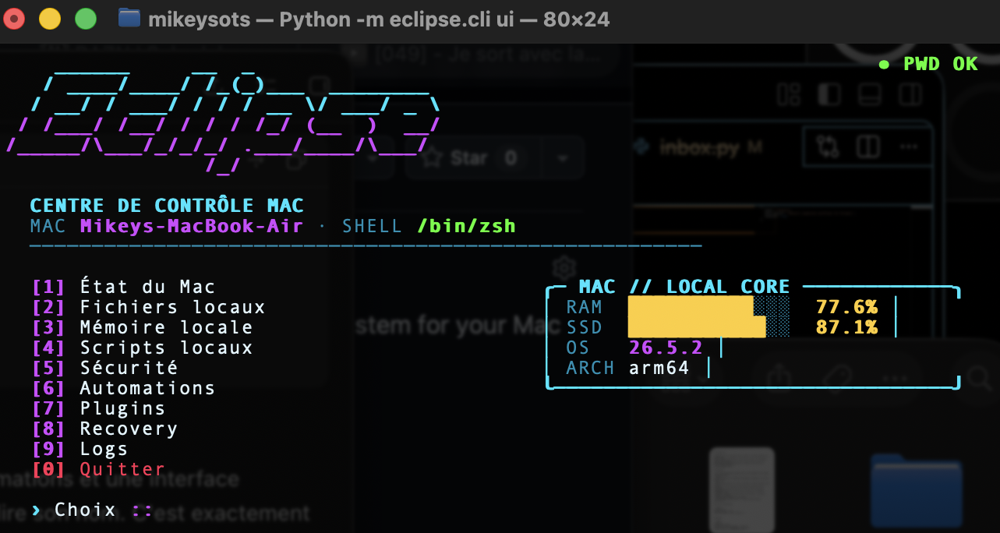

# Eclipse 0.3

Eclipse is a local macOS control center. It helps inspect the current Mac,
browse common user folders, store local notes, run personal scripts, and review
basic administration and security signals from either an interactive terminal UI
or the command line.

## Preview



## Features

- Local Mac dashboard: macOS version, CPU, memory, disk usage, shell, and home
  folder.
- Quick inspection of Desktop, Downloads, Documents, Pictures, Movies, and
  Music.
- Local JSONL memory for notes, decisions, tags, projects, and exports.
- Personal script registry with private copies and local execution.
- Packaged macOS maintenance scripts for backup, restore, cleanup, quarantine
  audit, DMG inspection, and local secret checks.
- Mac-to-VPS file and folder upload through SSH/rsync with dry-run support.
- macOS administration and security checks for FileVault, Gatekeeper, SIP,
  firewall, sharing, network state, persistence, services, updates, filesystem
  permissions, processes, and Docker.
- Private JSONL audit log at `~/.local/state/eclipse/audit.jsonl`.

## Installation

Requirements:

- macOS
- Python 3.11 or newer
- `rsync` and `ssh` for VPS transfers

Recommended user install from a wheel:

```bash
python3 -m venv ~/.local/share/eclipse-venv
~/.local/share/eclipse-venv/bin/python -m pip install --upgrade pip
~/.local/share/eclipse-venv/bin/python -m pip install /path/to/eclipse_mac-0.3.0-py3-none-any.whl
~/.local/share/eclipse-venv/bin/eclipse ui
```

Alternative install from a source archive:

```bash
python3 -m venv ~/.local/share/eclipse-venv
~/.local/share/eclipse-venv/bin/python -m pip install --upgrade pip
~/.local/share/eclipse-venv/bin/python -m pip install /path/to/eclipse_mac-0.3.0.tar.gz
~/.local/share/eclipse-venv/bin/eclipse ui
```

Expose the `eclipse` command in future terminals:

```bash
printf '\nexport PATH="$HOME/.local/share/eclipse-venv/bin:$PATH"\n' >> ~/.zprofile
source ~/.zprofile
```

Verify the installation:

```bash
eclipse --version
eclipse scripts info backup-eclipse-data
eclipse vps upload --help
```

Update an existing installation:

```bash
~/.local/share/eclipse-venv/bin/python -m pip install --upgrade /path/to/eclipse_mac-0.3.0-py3-none-any.whl
```

Uninstall:

```bash
~/.local/share/eclipse-venv/bin/python -m pip uninstall eclipse-mac
```

Developer install from a local checkout:

```bash
cd ~/Eclipse
python3 -m venv .venv
.venv/bin/python -m pip install -e .
```

Build distributable archives from the project root:

```bash
python3 -m pip install build
python3 -m build
```

The generated files are written to `dist/`. Current artifacts:

```text
dist/eclipse_mac-0.3.0-py3-none-any.whl
dist/eclipse_mac-0.3.0.tar.gz
```

The packaged shell scripts and plugin manifests are included in both artifacts.

## Usage

```bash
eclipse ui
eclipse mac status
eclipse mac files downloads --limit 10
eclipse files ls ~/Downloads --limit 30
eclipse files cat ~/Notes/todo.txt
eclipse files write ~/Notes/todo.txt "New note" --append
eclipse files mkdir ~/Work/new-folder
eclipse files copy ~/Notes/todo.txt ~/Backups/todo.txt
eclipse files move ~/Backups/todo.txt ~/Backups/todo-old.txt
eclipse files trash ~/Backups/todo-old.txt --yes
eclipse files search ~/Documents invoice --name "*.pdf"
eclipse files preview ~/Documents/config.json
eclipse files script-add ~/scripts/cleanup.sh cleanup
eclipse automation add daily-security-scan --every day
eclipse automation add cleanup-downloads --every week --command scripts run cleanup-downloads
eclipse automation run-due --dry-run
eclipse scripts info cleanup
eclipse scripts history
eclipse plugins list
eclipse recovery snapshot
eclipse logs list --source scripts --limit 20
eclipse logs list --source audit --source security --query file-write
eclipse logs list --system --limit 20
eclipse security password status
eclipse security password confirm
eclipse admin status
eclipse security scan --check security --check firewall
eclipse security scan --json
eclipse admin report
eclipse memory add "Decision or observation" --tag mac,local --project eclipse
eclipse memory search observation --project eclipse
eclipse memory stats
eclipse memory export ~/Backups/eclipse-memory.json
eclipse scripts add cleanup ~/scripts/cleanup.sh --tag maintenance
eclipse scripts list
eclipse scripts run cleanup --dry-run -- --verbose
eclipse scripts run cleanup -- --verbose
eclipse vps upload ~/Documents/report.pdf --host 203.0.113.10 --user deploy --remote-path /srv/uploads --dry-run
eclipse vps upload ~/Projects/site --host example.com --remote-path /var/www/site
```

`eclipse ui` opens the interactive terminal control center. The first screen
shows the Mac status, then gives access to local files, local memory, personal
scripts, and the `Administration & Security` menu.

## Local Files

Eclipse includes a local file explorer for macOS. It can browse folders, preview
UTF-8 text files, create files and folders, copy, move, rename, send files to
the macOS Trash, and open paths through Finder or the default macOS app.
Sensitive paths such as system folders, `~/Library`, `~/.ssh`, `~/.gnupg`, and
`~/.config` require explicit confirmation before write operations.

Useful commands:

```bash
eclipse files favorites
eclipse files ls ~/Documents --hidden
eclipse files info ~/.ssh
eclipse files cat ~/Documents/note.txt
eclipse files write ~/Documents/note.txt "Appended note" --append
eclipse files edit-line ~/Documents/note.txt 2 "Replacement line"
eclipse files mkdir ~/Documents/Eclipse
eclipse files rename ~/Documents/old.txt new.txt
eclipse files copy ~/Documents/new.txt ~/Desktop/new.txt
eclipse files move ~/Desktop/new.txt ~/Documents/Eclipse/new.txt
eclipse files trash ~/Documents/Eclipse/new.txt --yes
eclipse files open ~/Documents
eclipse files preview ~/Downloads/archive.zip
eclipse files search ~/Projects config --name "*.json" --depth 5
eclipse files chmod+x ~/scripts/tool.sh
eclipse files script-add ~/scripts/tool.sh tool
```

`trash` requires `--yes` in the CLI. In the interactive UI, Eclipse asks for
confirmation before moving a path to the Trash. Mutating operations are written
to the private audit log, and Eclipse creates local backups before overwriting,
moving, renaming, editing, or trashing existing paths unless `--no-backup` is
used.

Preview supports directories, UTF-8 text, JSON pretty-printing, image metadata
for common formats, and ZIP archive listings.

Advanced search supports filename, content, extension, size, modification dates,
ignored folders, depth limits, result limits, and JSON export:

```bash
eclipse files search ~/Projects config --content database --extension py
eclipse files search ~/Documents --name "*.pdf" --min-size 10000
eclipse files search ~/Projects token --ignore .git --ignore node_modules --export ~/Desktop/results.json
```

## Automations

Eclipse can store local scheduled automations. It does not install a background
daemon by itself; `run-due` is the command to trigger from the terminal, a
LaunchAgent, cron, or another local scheduler.

Useful commands:

```bash
eclipse automation add daily-security-scan --every day
eclipse automation add cleanup-downloads --every week --command scripts run cleanup-downloads
eclipse automation list
eclipse automation run daily-security-scan --dry-run
eclipse automation run-due
eclipse automation disable cleanup-downloads
eclipse automation enable cleanup-downloads
eclipse automation history
```

Automation definitions and history are stored privately in:

```text
~/Library/Application Support/Eclipse/automation
```

## Logs

Eclipse includes a `logs` category that centralizes local activity logs with the
date, time, user, source, action, status, and details for each entry.

Supported sources:

- `audit`: Eclipse actions such as file writes, moves, backups, recovery, and
  automations.
- `scripts`: personal script execution history.
- `automation`: scheduled automation execution history.
- `security`: generated security reports.
- `system`: recent macOS system logs, queried on demand.

Useful commands:

```bash
eclipse logs list
eclipse logs list --source scripts --limit 20
eclipse logs list --source audit --source security --query firewall
eclipse logs list --user "$USER" --since 2026-09-01
eclipse logs list --system --limit 20
eclipse logs list --export ~/Desktop/eclipse-logs.json
```

`system` logs are read from macOS only when requested with `--system` or
`--source system`. Eclipse does not store system logs permanently by default.

## Administration And Security

The `security` category contains Eclipse's local macOS security features. The
main executable action is the security scan:

```bash
eclipse security scan
eclipse security scan --deep
eclipse security scan --check security --check firewall
eclipse security scan --json
```

The scanner is based on the original local Bash scanner, but it is integrated
directly into Eclipse and remains read-only. JSON reports are written by default
to:

```text
~/Library/Application Support/Eclipse/security-reports
```

`--deep` enables slower checks, including the macOS update lookup through
`softwareupdate -l`.

Eclipse also tracks password rotation. The UI header shows a password indicator
in the upper right:

- red by default when password rotation has not been confirmed;
- green after the user confirms passwords have been changed;
- red again after 6 months.

Useful commands:

```bash
eclipse security password status
eclipse security password confirm
eclipse admin status
eclipse admin report
eclipse security scan --json --output-dir ~/Backups/eclipse-security
```

The password rotation state is stored privately in:

```text
~/Library/Application Support/Eclipse/security-state.json
```

## Local Memory

By default, memory entries are stored in:

```text
~/Library/Application Support/Eclipse/memory.jsonl
```

The file is created with private permissions. Each entry contains an identifier,
a UTC timestamp, the text, optional tags, a source, and a project.

For tests, scripts, or migrations, set `ECLIPSE_MEMORY_PATH` to override the
default path:

```bash
ECLIPSE_MEMORY_PATH=/path/to/memory.jsonl eclipse memory stats
```

## Local Scripts

By default, Eclipse stores the script registry and private script copies in:

```text
~/Library/Application Support/Eclipse/scripts
```

Scripts ending in `.py`, `.sh`, `.bash`, `.zsh`, and `.js` are executed with the
matching local interpreter. Other files are executed directly.

You can also drop personal scripts directly into the project-level `scripts/`
folder, or into `eclipse/scripts/` if you want the drop-in folder next to the
Python package. Eclipse discovers files from those folders automatically, lists
them in the CLI and UI, and lets you execute them without running
`eclipse scripts add`. Files inside both drop-in folders are ignored by Git so
personal scripts are not published with the project.

Useful commands:

```bash
eclipse scripts add name ~/scripts/tool.py --description "local tool" --tag mac
eclipse scripts add risky ~/scripts/risky.sh --dry-run-required
eclipse scripts list
eclipse scripts info name
eclipse scripts history
eclipse scripts run name -- --flag
eclipse scripts run risky --dry-run
eclipse scripts run risky --force
eclipse scripts path name
eclipse scripts remove name --delete-file
```

For tests or a separate profile, set `ECLIPSE_SCRIPTS_HOME` to override the
default scripts directory:

```bash
ECLIPSE_SCRIPTS_HOME=/path/to/scripts eclipse scripts list
```

Script metadata can be declared in the first comments of a script:

```bash
# eclipse: description: Clean local build caches
# eclipse: tags: cleanup, maintenance
# eclipse: param: --dry-run
# eclipse: dry-run-required: true
```

Eclipse reads those comments into the script catalog, displays declared
parameters, tracks execution history, and records the latest return code.

Packaged scripts:

- `daily-maintenance`: runs the security scan, light cleanup checks, and a
  summary report.
- `backup-eclipse-data`: backs up Eclipse data, scripts, logs, memory, recovery,
  plugins, and selected config files.
- `restore-eclipse-data`: guides a restore from an Eclipse backup.
- `rotate-local-backups`: keeps the latest backups and removes older ones.
- `quarantine-downloads-audit`: lists downloaded files with macOS quarantine
  metadata.
- `safe-open-dmg`: inspects a DMG before opening it.
- `project-clean-cache`: removes common development caches from a project.
- `find-secrets-local`: searches for likely local secrets without printing them
  in clear text.
- `verify-backup`: checks that a `.tar.gz` backup is readable.
- `user-system-backup`: creates a local user system backup on the Desktop.

Examples:

```bash
eclipse scripts info daily-maintenance
eclipse scripts run daily-maintenance --force -- --dry-run
eclipse scripts run backup-eclipse-data --force -- --dry-run
eclipse scripts run safe-open-dmg --force -- --file ~/Downloads/app.dmg
```

## VPS Transfers

The `vps` category manages workflows between the local Mac and a remote VPS.
The first available workflow uploads a local file or folder through `rsync`
over SSH.

Useful commands:

```bash
eclipse vps upload ~/Documents/report.pdf --host 203.0.113.10 --user deploy --remote-path /srv/uploads --dry-run
eclipse vps upload ~/Projects/site --host example.com --remote-path /var/www/site --identity ~/.ssh/id_ed25519
eclipse vps upload ~/Backups/eclipse.tar.gz --host example.com --port 2222 --remote-path /home/deploy/backups
```

`--dry-run` asks `rsync` to show what would be transferred before writing to the
VPS. The command validates the local source, SSH port, identity file, host, user,
and remote path before starting the transfer.

VPS-specific code lives under:

```text
eclipse/vps/
  vps.py
  config/config.sh
```

`config/config.sh` can store optional defaults:

```bash
ECLIPSE_VPS_HOST="example.com"
ECLIPSE_VPS_USER="deploy"
ECLIPSE_VPS_REMOTE_PATH="/srv/uploads"
ECLIPSE_VPS_PORT="22"
ECLIPSE_VPS_IDENTITY="~/.ssh/id_ed25519"
```

Eclipse reads simple `KEY=value` lines from this file; it does not execute the
file as shell code. When these values are configured, the upload command can be
shorter:

```bash
eclipse vps upload ~/Documents/report.pdf --dry-run
```

## Plugins

Eclipse has a lightweight plugin layout so future modules can live outside the
core package:

```text
plugins/
  docker/
  homebrew/
  git/
  network/
  ai/
```

Each plugin has a `plugin.json` manifest. Current commands:

```bash
eclipse plugins list
eclipse plugins create local-tools --description "Local helper workflows"
```

## Recovery

Recovery mode snapshots Eclipse's private operational data, including local
memory, script registry/copies, and the audit log when those files exist.

Useful commands:

```bash
eclipse recovery snapshot
eclipse recovery export ~/Library/Application\ Support/Eclipse/recovery/snapshot-YYYYMMDD-HHMMSS
eclipse recovery export ./snapshot --password "local-passphrase"
eclipse recovery restore ./snapshot --destination ~/Desktop/eclipse-restore --yes
```

Snapshots are stored by default in:

```text
~/Library/Application Support/Eclipse/recovery
```

## Privacy

Eclipse is designed to keep local operational data outside the repository.
Generated memory files, script copies, security reports, caches, logs, virtual
environments, environment files, and project-level drop-in scripts are ignored
by Git.

Before publishing the project, review the pending Git changes and run a secret
scan or equivalent check for personal paths, tokens, keys, and credentials.

## Tests

```bash
python3 -m unittest discover -s tests -v
```
