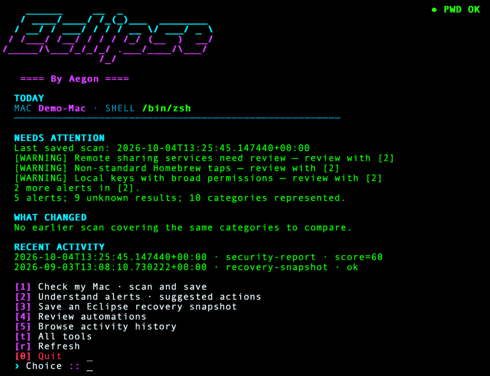
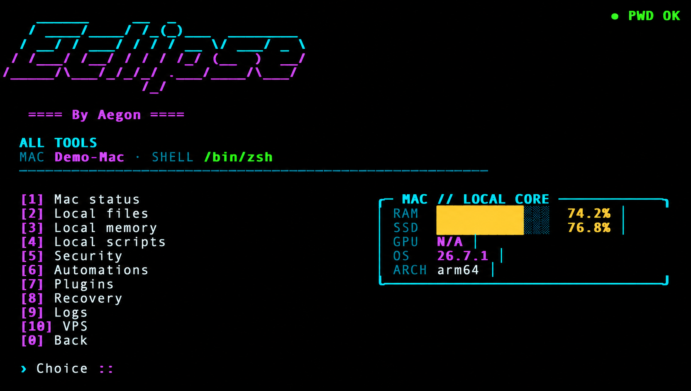

# Eclipse

**A local macOS control center for the terminal.**

Eclipse brings Mac checks, personal scripts, files, notes, recovery snapshots,
and activity history into one place. Open the daily overview, see what needs
attention, run a scan, and inspect the evidence when you need it.

Version **0.3.0** · **macOS** · **Python 3.11+** · Terminal UI and CLI

[Install](#install-and-launch) · [Screenshots](#screenshots) · [Features](#what-eclipse-does) ·
[Command guide](docs/usage.md) · [Troubleshooting](docs/installation.md#troubleshooting) ·
[Contributing](CONTRIBUTING.md)

## Install and launch

1. Install Python **3.11 or newer** using a [Python macOS installer](https://www.python.org/downloads/macos/), if needed. Check with `python3 --version`.
2. On this GitHub repository, choose **Code → Download ZIP**, then extract it.
3. Open Terminal in the extracted folder containing `install.sh`. You can type `cd `, drag the folder into Terminal, and press Enter.
4. Run:

```bash
bash install.sh
~/.local/share/eclipse-venv/bin/eclipse ui
```

The installer creates a dedicated Python environment, installs Eclipse and its
Python dependencies, verifies the CLI and packaged scripts, and adds the command
to `~/.zprofile`. It does not require `sudo`. Internet access is needed to download
dependencies. Git and Homebrew are not required for this installation route.

After opening a new zsh terminal:

```bash
eclipse ui
```

Already cloned the repository? Run the same commands from the repository root.
For a different Python interpreter, use `bash install.sh --python python3.14`.
See [installation options, release archives, updating and uninstalling](docs/installation.md).

There is no bundled `.app`, DMG, or one-click native installer. macOS compatibility
also depends on your Python version and access to the system utilities used by
each check. Windows and Linux are not supported targets.

## First run

The **TODAY** screen shows saved scan alerts, changes across scans with matching recorded checks, scan mode and check revision, and recent local activity. No security scan runs automatically
when you open it. With no report yet, choose **1**.

| Key | Action |
| --- | --- |
| `1` | Check the Mac and save the report |
| `2` | Review the latest saved alerts, evidence and suggested actions |
| `3` | Create a snapshot of Eclipse memory, registered scripts and audit log |
| `4` | Review and manage automations |
| `5` | Browse activity history |
| `t` | Open all tools, including files, scripts, security and VPS uploads |
| `r` | Refresh the overview |
| `0` | Quit |

During interactive scans, Eclipse prints the current check and its completion state.
A failed check does not prevent the remaining checks from running. After a scan, a short summary separates passed checks, findings to review, and
skipped or uncertain checks. Press **d** for technical details, **a** for suggested
actions, or **Enter** to return. Scans inspect settings; they do not apply the
suggested changes. The slower macOS update lookup requires `eclipse security scan --deep`.

The detailed security score is a heuristic over reported findings, not a guarantee
of security. Inventory and unavailable checks are distinguished. Old saved reports
keep their original classifications. New reports record execution coverage (schema 3).
The overview compares only checks completed in both matching scans; skipped,
failed and incomplete checks are shown as not comparable. Run two new scans to
start this comparison history. CLI diffs can still show explicit changes between
two legacy reports, but do not treat absent findings as resolved alerts.

The overview and menu headers avoid detailed GPU/network queries. Detailed Mac
status is cached for up to 15 seconds; `r` and interactive scans clear the cache.
A new scan always executes its checks; identical commands within that scan reuse
their result. No scan results are reused across separate scans.

## Screenshots

The computer names in these screenshots have been replaced with a generic demo name.

### Home — TODAY

The daily overview brings saved scan alerts, changes and recent activity together,
with shortcuts to scan the Mac, review findings and create a recovery snapshot.



### All tools

The tools menu gives access to every module, alongside a compact view of the Mac's
memory, storage and system information.



## What Eclipse does

| Area | Available features |
| --- | --- |
| Mac | CPU, RAM, disk, GPU information where available, network and system details |
| Files | Browse, search, preview, write, copy, move, rename, Trash, backups before supported mutations |
| Security | FileVault, Gatekeeper, SIP, firewall, sharing, persistence, permissions, Docker checks; reports, diffs, baselines and policies |
| Scripts | Register private copies, discover local scripts, preview commands, execute, track history |
| Memory | Local notes with tags and projects; search, edit, export |
| Automations | Store schedules, preview and run due jobs, review execution history |
| Recovery | Snapshot selected Eclipse data; export ZIP or encrypted archives; restore to an empty destination |
| Logs | Browse Eclipse activity; query macOS logs when requested |
| VPS | Upload files or folders using rsync over SSH, with dry-run support |
| Plugins | List and create plugin manifests; executable extension hooks are not implemented |

Automations require you or an external scheduler to invoke `eclipse automation
run-due`; Eclipse does not install a background service. Recovery snapshots are
not whole-Mac backups. The password indicator records your confirmation of a
password change; it does not verify or change passwords. Homebrew and Docker are
optional; their corresponding checks depend on their availability.

For command examples and bundled scripts, see the [command guide](docs/usage.md).

## Where data lives

Paths below are relative to your home directory. Files appear as features are used.

| Data | Default location |
| --- | --- |
| Installed environment | `~/.local/share/eclipse-venv/` |
| Notes | `~/Library/Application Support/Eclipse/memory.jsonl` |
| Registered scripts and history | `~/Library/Application Support/Eclipse/scripts/` |
| Scan reports | `~/Library/Application Support/Eclipse/security-reports/` |
| Security baseline / policy / password confirmation | `~/Library/Application Support/Eclipse/security-{baseline,policy,state}.json` |
| Automations and history | `~/Library/Application Support/Eclipse/automation/` |
| Recovery snapshots | `~/Library/Application Support/Eclipse/recovery/` |
| Backups before file changes | `~/Library/Application Support/Eclipse/backups/` |
| User plugin manifests | `~/Library/Application Support/Eclipse/plugins/` |
| Audit log | `~/.local/state/eclipse/audit.jsonl` |

Operational data stays outside the repository by default. Reports can contain
personal paths, process arguments and network information; review them before
sharing. Uninstalling the Python package leaves these data files in place.
VPS uploads and scripts can communicate externally when you run them.

## Development and GitHub distribution

```bash
python3 -m venv .venv
.venv/bin/python -m pip install -e .
.venv/bin/python -m unittest discover -s tests -v
.venv/bin/eclipse ui
```

GitHub Actions is configured to test on macOS with Python 3.11 and 3.14, build the
wheel/source archive, and smoke-test installed distributions outside the checkout.
The workflow uploads downloadable build artifacts; it does not publish a release
automatically. See [the release guide](docs/releasing.md) for packaging and GitHub
Release steps, and [CONTRIBUTING.md](CONTRIBUTING.md) for development checks.

No license file is currently included. Distribution and contribution licensing
must be clarified by the maintainer before describing Eclipse as open source.
